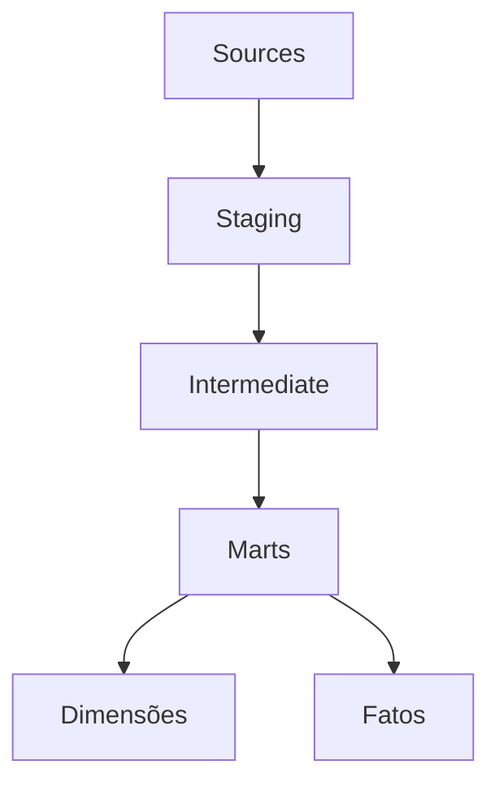
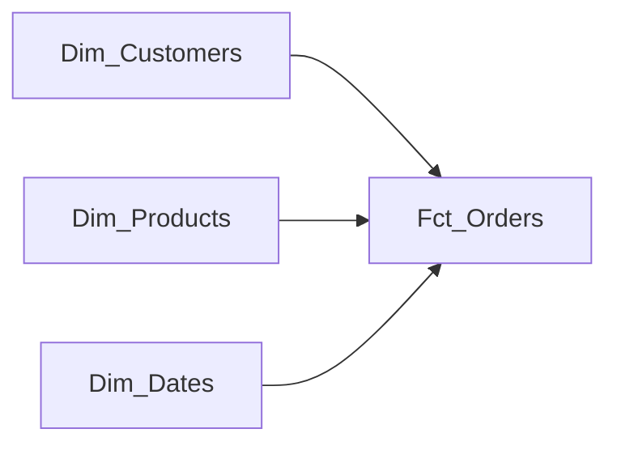
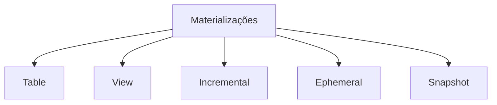
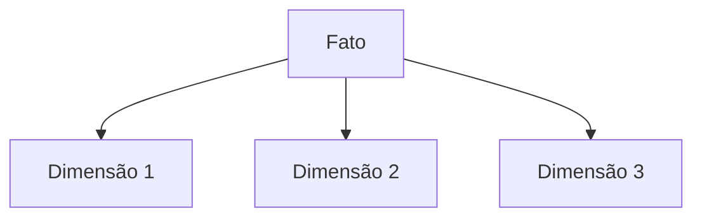

# Modelos no dbt

Esta seção aborda os diferentes tipos de modelos e suas aplicações no dbt, com exemplos práticos e diagramas explicativos.

## 1. Tipos de Modelos

### Arquitetura de Camadas


### Sources
- Representam as tabelas brutas do data warehouse
- Configurados em `sources.yml`
- Permitem rastreamento de freshness
- Exemplo:
```yaml
sources:
  - name: raw
    database: raw_data
    schema: public
    tables:
      - name: customers
        loaded_at_field: updated_at
```

### Staging
- Primeira camada de transformação
- Limpeza e padronização básica
- Nomenclatura: stg_[source]__[entity]
- Exemplo:
```sql
{{ config(materialized='view') }}

SELECT
    id as customer_id,
    LOWER(email) as email,
    INITCAP(first_name) as first_name,
    created_at
FROM {{ source('raw', 'customers') }}
```

### Intermediate
- Modelos intermediários reutilizáveis
- Transformações complexas
- Nomenclatura: int_[entity]_[verb]
- Exemplo:
```sql
{{ config(materialized='table') }}

WITH customer_orders AS (
    SELECT 
        customer_id,
        COUNT(*) as total_orders,
        SUM(amount) as total_amount
    FROM {{ ref('stg_orders') }}
    GROUP BY 1
)
```

### Marts
- Modelos dimensionais finais
- Organizados por área de negócio
- Base para relatórios e análises

### Dimensões e Fatos


## 2. Materializações

### Tipos de Materialização


### Table
- Recria a tabela completa a cada execução
- Ideal para dimensões pequenas
```sql
{{ config(materialized='table') }}
```

### View
- Não armazena dados
- Ideal para transformações simples
```sql
{{ config(materialized='view') }}
```

### Incremental
- Atualiza apenas novos registros
- Ideal para fatos grandes
```sql
{{ config(
    materialized='incremental',
    unique_key='order_id'
) }}

SELECT * FROM {{ source('raw', 'orders') }}

WHERE created_at > (SELECT MAX(created_at) FROM {{ this }})

```

### Ephemeral
- Compilado como CTE
- Não cria objeto no banco
```sql
{{ config(materialized='ephemeral') }}
```

### Snapshot
- Rastreia mudanças tipo 2 (SCD)
```sql

{{ config(
    target_schema='snapshots',
    strategy='timestamp',
    unique_key='customer_id',
    updated_at='updated_at'
) }}

SELECT * FROM {{ source('raw', 'customers') }}

```

## 3. Estrutura de Modelos

### Organização de Diretórios
```
models/
├── staging/
│   ├── stg_customers.sql
│   └── stg_orders.sql
├── intermediate/
│   └── int_customer_orders.sql
└── marts/
    ├── core/
    │   ├── dim_customers.sql
    │   └── fct_orders.sql
    └── marketing/
        └── customer_segmentation.sql
```

### Nomenclatura
- staging: stg_[source]__[entity]
- intermediate: int_[entity]_[verb]
- marts: 
  - dim_[entity]
  - fct_[entity]

### Documentação
```yaml
version: 2
models:
  - name: dim_customers
    description: Dimensão de clientes
    columns:
      - name: customer_id
        description: Chave primária
        tests:
          - unique
          - not_null
```

## 4. Padrões e Boas Práticas

### Modelagem Dimensional


### Granularidade
- Definir nível adequado
- Documentar claramente
- Manter consistência

### Testes de Qualidade
```yaml
models:
  - name: fct_orders
    tests:
      - dbt_utils.equal_rowcount:
          compare_model: ref('stg_orders')
    columns:
      - name: order_id
        tests:
          - unique
          - not_null
          - relationships:
              to: ref('dim_customers')
              field: customer_id
```

## 5. Técnicas Avançadas

### CTEs
```sql
WITH customers AS (
    SELECT * FROM {{ ref('stg_customers') }}
),

orders AS (
    SELECT * FROM {{ ref('stg_orders') }}
),

final AS (
    SELECT 
        c.*,
        o.total_orders
    FROM customers c
    LEFT JOIN orders o ON c.customer_id = o.customer_id
)

SELECT * FROM final
```

### Jinja e Macros
```sql


SELECT 
    order_id,
    
    SUM(CASE WHEN payment_method = '{{ payment }}' THEN amount END) as {{ payment }}_amount
    ,
    
FROM {{ ref('stg_payments') }}
GROUP BY 1
```

### Packages
```yaml
packages:
  - package: dbt-labs/dbt_utils
    version: 0.8.0
```

## Exercícios Práticos

1. **Criar modelo staging**
   - Criar `stg_customers.sql` e `stg_orders.sql`
   - Implementar testes básicos
   - Documentar colunas

2. **Implementar modelo incremental**
   - Criar `fct_daily_sales.sql`
   - Configurar estratégia incremental
   - Adicionar testes de integridade

3. **Desenvolver dimensão SCD Type 2**
   - Criar snapshot para `dim_customers`
   - Implementar campos de controle
   - Testar diferentes cenários

4. **Criar fato com agregações**
   - Desenvolver `fct_order_summary`
   - Implementar métricas de negócio
   - Criar testes de reconciliação

5. **Documentar e testar modelos**
   - Criar documentação completa
   - Implementar testes genéricos e singulares
   - Gerar documentação com lineage

## Recursos Adicionais

- [Modelos no dbt](https://docs.getdbt.com/docs/build/models)
- [Materializações](https://docs.getdbt.com/docs/build/materializations)
- [Jinja e Macros](https://docs.getdbt.com/docs/build/jinja-macros)
- [Testes](https://docs.getdbt.com/docs/build/tests)
- [Documentação](https://docs.getdbt.com/docs/collaborate/documentation)
- [Packages](https://hub.getdbt.com) 